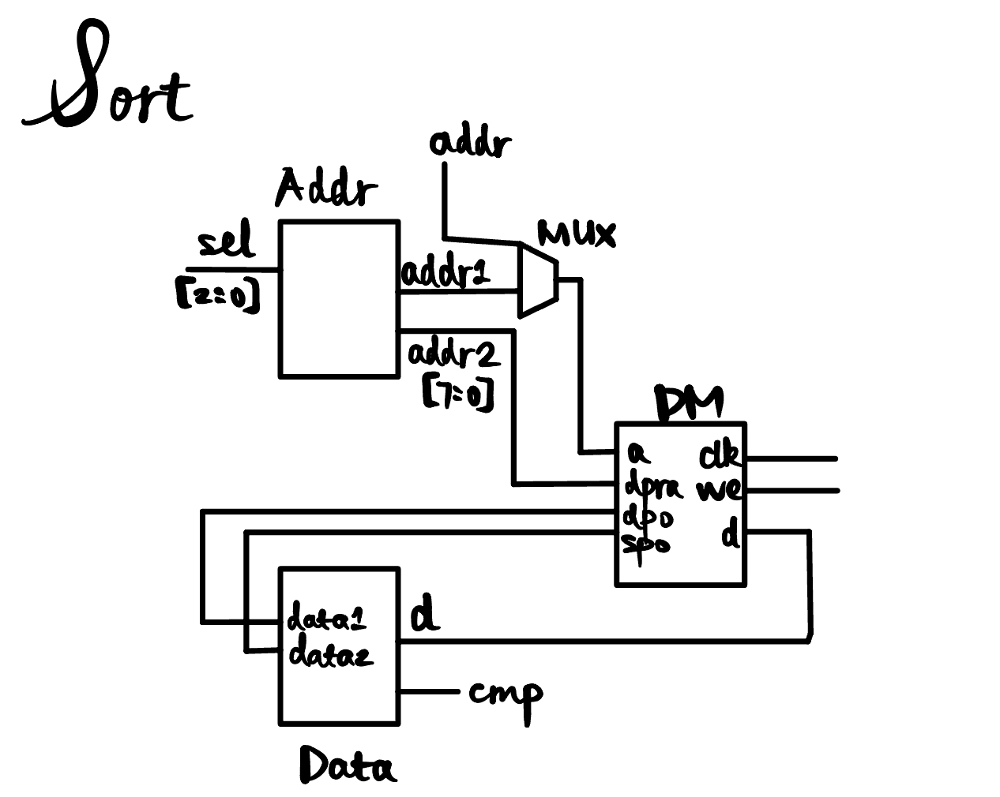
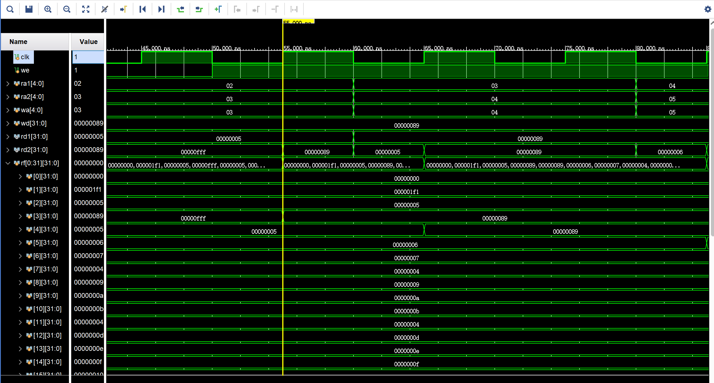
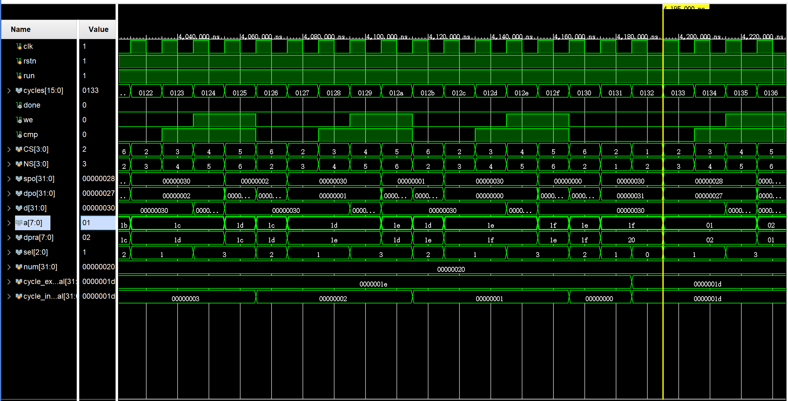
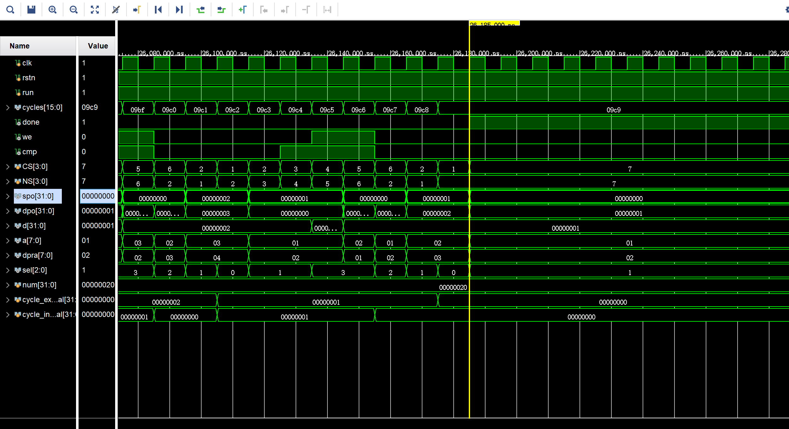
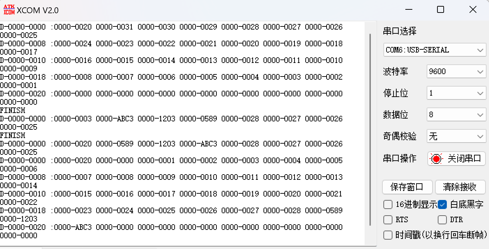
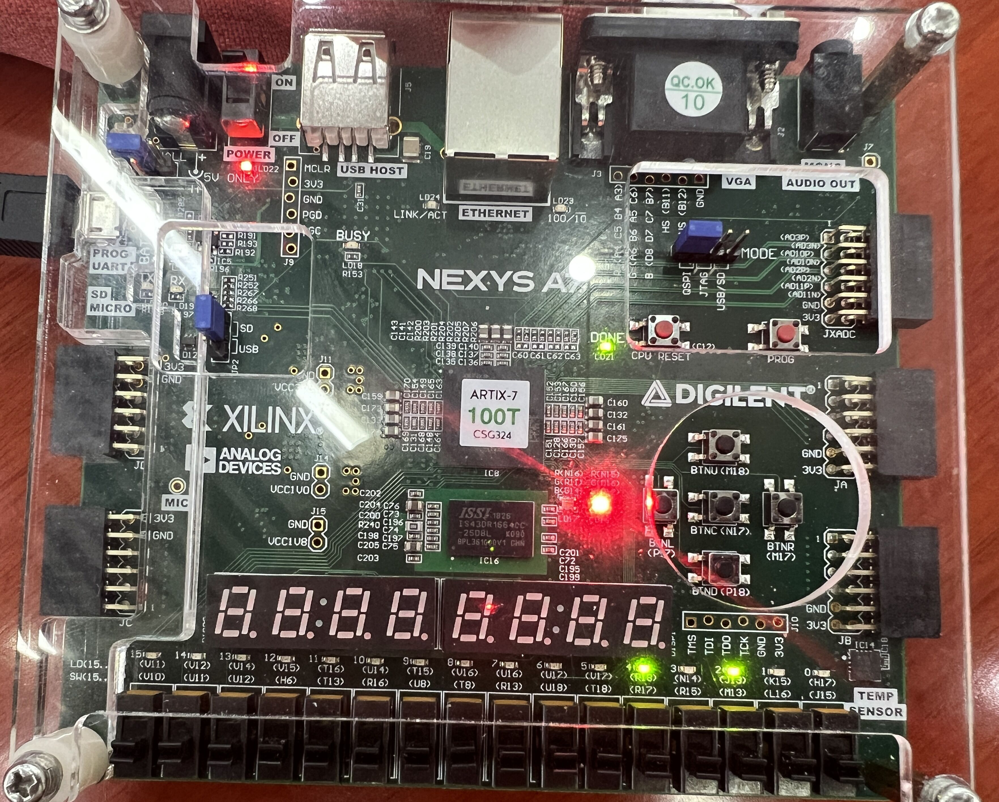
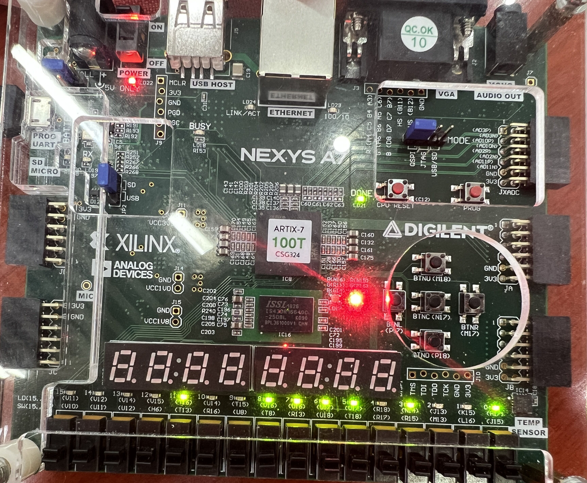
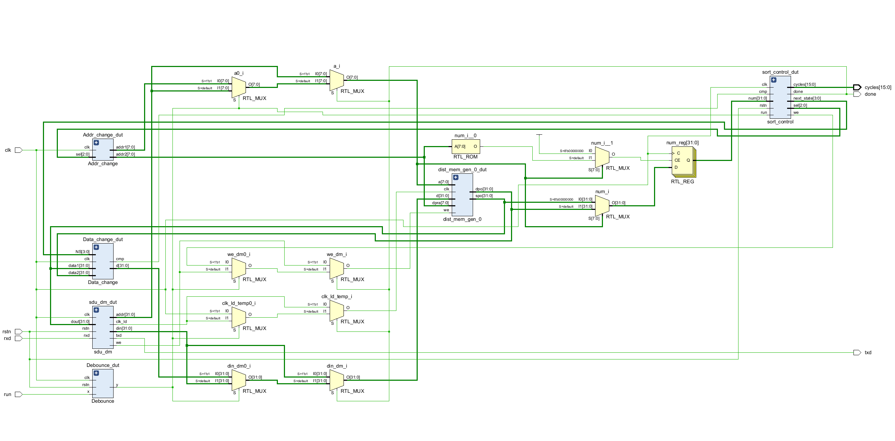

# Lab2

> `Name:王昱`				`ID：PB21030814`

## 实验内容

* 寄存器、存储器的功能和时序
* 实现数据排序

## 逻辑设计

### 数据通路




### FSM

```mermaid
graph LR;
	A((s8)) --> B((s9))
	B((s9)) --> C((s10))
	C((s10)) --> D((s0))
	D((s0)) --> E((s1))
	E((s1)) --> F((s2))
	F((s2)) --> G((s3))
	G((s3)) --> H((s4))
	G((s3)) --> I((s6))
	H((s4)) --> J((s5))
	J((s5)) --> I((s6))
	E((s1)) --> K((s7))
	F((s2)) --> E((s1))
	I((s6)) --> F((s2))
	K((s7)) --> A((s8))
```

> 本次选用的排序算法是**冒泡排序**，算法相对容易理解(但是设计的状态机状态有点多)
>
> 其中`s8`	`s9`	`s10`存在的目的是等待获取数组的大小
>
> `s0`的目的是每次启动排序时将`done`清零，`cycles`清零
>
> `s1`控制外层循环	`s2`控制内层循环
>
> `s3`用于判断是否需要交换
>
> `s4`	`s5`用于交换数据(因为一次只能写一次)
>
> `s7`是结束，连到`s8`是说明`rstn`之后的状态是`s8`

## 核心代码

* `register_file`

```verilog
module register_file(
    input clk,
    input [4:0] ra1, ra2,   //读地址
    output [31:0] rd1, rd2, //读数据
    input [4:0] wa,         //写地址
    input [31:0] wd,        //写数据
    input we                //写使能
    );

    reg [31:0] rf [0:31];   //寄存器堆
    assign rd1 = rf[ra1];
    assign rd2 = rf[ra2];
    
    always @(posedge clk) begin
        rf[0] <= 0;  //满足0号寄存器的内容恒为零
    end

    always @(posedge clk) begin
        //忽略对0号寄存器的写
        if(we && wa != 5'b0)begin
            rf[wa] <= wd;   //写操作
        end   
    end
endmodule
```

> 此处忽略了对寄存器堆的初始化部分代码

* `sort_fsm`

```verilog
module sort_control(
    input clk, rstn, run, cmp,  //cmp用于判断是否需要交换
    input [31:0] num,           //数组大小
    output reg [15:0] cycles,
    output reg done, we,
    output reg [2:0] sel,       //用于地址的更替(Addr_change.v)
    output [3:0] next_state     //用于s4、s5状态写数据(Data_change.v)
    );

    parameter s0 = 4'b0000,
              s1 = 4'b0001,
              s2 = 4'b0010,
              s3 = 4'b0011,
              s4 = 4'b0100,
              s5 = 4'b0101,
              s6 = 4'b0110,
              s7 = 4'b0111,
              s8 = 4'b1000,
              s9 = 4'b1001,
              s10 = 4'b1010;
    reg [3:0] CS, NS;
    reg [31:0] cycle_external, cycle_internal;   //外层循环、内层循环

    assign next_state = NS;

    always @(posedge clk or negedge rstn) begin
        if(!rstn)
            CS <= s8;
        else
            CS <= NS;
    end

    always @(*) begin
        if(run)begin
            if(CS == s0)
                NS = s1;
            else if(CS == s1)begin
                if(cycle_external > 0)
                    NS = s2;
                else    
                    NS = s7;    //退出循环
            end
            else if(CS == s2)begin
                if(cycle_internal > 0)
                    NS = s3;
                else    
                    NS = s1; 
            end
            else if(CS == s3)begin
                if(cmp)
                    NS = s4;
                else
                    NS = s6;     
            end
            else if(CS == s4)
                NS = s5;
            else if(CS == s5)
                NS = s6;
            else if(CS == s6)
                NS = s2;
            else if(CS == s8)
                NS = s9;
            else if(CS == s9)
                NS = s10;
            else if(CS == s10)
                NS = s0;
            else    
                NS = s7;
        end
        else
            NS = s8;
    end

    always @(posedge clk or negedge rstn) begin
        if(!rstn)begin
            cycles <= 16'h0000;
            done <= 1'b0;
            cycle_external <= num;
            cycle_internal <= 0;    
            we <= 0;
            sel <= 3'b100;
        end
        else if(run)begin
            case(NS)
                s10: ;
                s9: ;
                s8: ;
                s0: begin
                    cycle_external <= num;
                    cycle_internal <= 0;
                    we <= 0;
                    sel <= 3'b100;
                    cycles <= 16'h0000;
                    done <= 1'b0;
                end
                s1: begin
                    cycle_external <= cycle_external - 1;
                    cycle_internal <= cycle_external - 1;
                    sel <= 3'b000;
                    cycles <= cycles + 1;
                end
                s2: begin
                    sel <= 3'b001;
                    cycles <= cycles + 1;
                end
                s3: begin
                    cycles <= cycles + 1;
                end
                s4: begin
                    cycles <= cycles + 1;
                    we <= 1;
                    sel <= 3'b011;
                end
                s5: begin
                    cycles <= cycles + 1;
                end
                s6: begin
                    cycle_internal <= cycle_internal - 1;
                    cycles <= cycles + 1;
                    we <= 0;
                    sel <= 3'b010;
                end
                s7: begin
                    sel <= 3'b001;
                    done <= 1'b1;
                end
            endcase
        end
        else begin
            cycles <= cycles;
            done <= done;
            cycle_external <= cycle_external;
            cycle_internal <= cycle_internal;
        end
    end

endmodule
```

> `FSM`采用了三段式的写法，各状态的含义上面已描述过，不再赘述
>
> 这里值得注意的是：**组合电路不要生成latch**，在第二个always块里一开始用case语句写的一直出现`latch`，导致了上板结果出错。

* `addr_reg`

```verilog
module Addr_change(
    input clk,
    input [2:0] sel,
    output reg [7:0]addr1, addr2
    );
    always @(posedge clk) begin
        case(sel)
            3'b000: begin
                addr1 <= 8'h01;
                addr2 <= 8'h02;
            end 
            3'b001: begin
                addr1 <= addr1;
                addr2 <= addr2;
            end
            3'b010: begin
                addr1 <= addr1 + 1;
                addr2 <= addr2 + 1;
            end
            3'b011: begin
                addr1 <= addr2;
                addr2 <= addr1;
            end
            3'b100: begin
                addr1 <= 8'h00;
                addr2 <= 8'h00;
            end
        endcase
    end
endmodule
```

> 该部分是一个地址寄存器，根据`fsm`产生的`sel`信号修改地址

* `data_reg`

```verilog
module Data_change(
    input [31:0] data1, data2,
    input clk,
    input [3:0] NS,
    output reg cmp,
    output reg [31:0] d
    );

    always @(posedge clk) begin
        if(data1 > data2)begin
            cmp <= 1;
            if(NS == 4'b0100)
                d <= data2;
            else if(NS == 4'b0101)
                d <= data1;
            else 
                d <= d;
        end
        else begin
            cmp <= 0;
        end
    end
endmodule
```

> 该部分是一个数据寄存器，用于比较数据的大小输出`cmp`给`fsm`
>
> 该模块与`addr_reg`联合起来一起完成数据之间的交换、地址的更改

* `top`文件

```verilog
module lab2_top(
    input clk,
    input rstn,
    input run,              //启动排序
    output done,            //排序结束
    output [15:0] cycles,   //排序耗费时钟周期数
    input rxd, 
    output txd
    );
    //SDU_DM接口
    wire [31:0] addr;       //读or写地址
    wire [31:0] dout;       //读数据
    wire [31:0] din;        //写数据
    wire we;                //写使能    
    wire clk_ld;            //写时钟


    wire [31:0] dpo;
    //这里存储器开了8位的地址
    wire [7:0] dpra;
    wire [2:0] sel;
    wire [3:0] NS;
    wire cmp, run_final;

    //下面用于解决多驱动问题
    //排序结束作为选择信号
    wire [7:0] a;
    wire [31:0] addr_temp;
    assign a = done ? addr_temp[7:0] : (run_final ? addr[7:0] : addr_temp[7:0]); 

    wire we_temp, we_dm;
    assign we_dm = done ? we_temp : (run_final ? we : we_temp);

    wire [31:0] din_temp, din_dm;
    assign din_dm = done ? din_temp : (run_final ? din : din_temp);

    wire clk_ld_temp;
    assign clk_ld_temp = done ? clk_ld : (run_final ? clk : clk_ld);

    //下面用于获取数组大小
    reg [31:0] num;
    wire [31:0] temp;
    always @(posedge clk) begin
        if(a == 0)
            num <= dout;
        else if(dpra == 0)
            num <= dpo;
        else 
            num <= num;
    end
    assign temp = num;

    Debounce Debounce_dut(
        .clk(clk),
        .rstn(rstn),
        .x(run),
        .y(run_final)
    );
    dist_mem_gen_0 dist_mem_gen_0_dut (
        .a(a),              // input wire [7 : 0] a
        .d(din_dm),            // input wire [31 : 0] d
        .dpra(dpra),        // input wire [7 : 0] dpra
        .clk(clk_ld_temp),  // input wire clk
        .we(we_dm),         // input wire we
        .spo(dout),         // output wire [31 : 0] spo
        .dpo(dpo)           // output wire [31 : 0] dpo
    );

    Addr_change Addr_change_dut(
        .clk(clk),
        .sel(sel),
        .addr1(addr[7:0]),
        .addr2(dpra)
    );
    Data_change Data_change_dut(
        .clk(clk),
        .data1(dout),
        .data2(dpo),
        .NS(NS),
        .cmp(cmp),
        .d(din)
    );
    sort_control sort_control_dut(
        .clk(clk),
        .rstn(rstn),
        .run(run_final),
        .cmp(cmp),
        .cycles(cycles),
        .done(done),
        .we(we),
        .sel(sel),
        .next_state(NS),
        .num(temp)
    );
    sdu_dm sdu_dm_dut(
        .clk(clk),
        .rstn(rstn),
        .rxd(rxd),
        .txd(txd),
        .addr(addr_temp),
        .dout(dout),
        .din(din_temp),
        .we(we_temp),
        .clk_ld(clk_ld)
    );
endmodule

```

> 这里根据`fsm`的设计，对`run`信号只**去抖动而不取边沿**
>
> 最重要的部分就是`sdu_dm`和存储器之间的接口交互问题。我一开始由于太想当然，直接将信号共享，导致出现了**多驱动**的问题。之后我又仅仅用`done`作为选择信号而没有用`run`，导致在没有排序的时候不能有效读/写数据，出现`bug`

## 仿真结果

* `register_file`

```verilog
module register_file_tb();

    reg clk, we;
    reg [4:0] ra1, ra2, wa;
    reg [31:0] wd;
    wire [31:0] rd1, rd2;
    
    initial begin
        clk = 1'b0;
        we = 1'b0;
        ra1 = 5'b0;
        ra2 = 5'b1;
        wa = 5'b1;
        wd = 32'h89;

        #50 we = 1'b1;
        #5000 we = 1'b0; 
    end

    always #5 clk = ~clk;
    always #20 wa = wa + 1;
    always #20 ra1 = ra1 + 1;
    always #20 ra2 = ra2 + 1;
    always #100 wd = wd + 10;
    
    register_file register_file_dut(
        .clk(clk),
        .we(we),
        .ra1(ra1),
        .ra2(ra2),
        .wa(wa),
        .wd(wd),
        .rd1(rd1),
        .rd2(rd2)
    );
endmodule
```



> wa = 3，当clk在上升沿且we = 1的时候，rd2由00000fff变为00000089，说明是写优先

* `sort_top`

> 这里的`sort_top`是排序算法的一个`top`文件
>
> 具体请见源码

> 这里给存储器初始化了32个数，为**0-31**。

```verilog
module sort_top_tb();

    reg clk, rstn, run;
    wire [15:0] cycles;
    wire done;

    initial begin
        clk = 1'b0;
        rstn = 1'b0;
        run = 1'b1;
        #5 rstn = 1'b1;
        #1000 rstn = 1'b0;
        #100 rstn = 1'b1;
    end
    always #5 clk = ~clk;
    sort_top sort_top_dut(
        .clk(clk),
        .rstn(rstn),
        .run(run),
        .cycles(cycles),
        .done(done)
    );
    
endmodule
```





> 由于`sort_top`的仿真太长，这里不一一展示
>
> 挑出了内层循环每次到达边界以及排序终止的图
>
> 由图可知排序是正确的

## 下载结果







> 存储器初始化了32个数，为0-31，后写入三个数并排序，后重新写入数组大小并排序
>
> 结果如上图所示，可以看到数组升序排列

## 电路资源

* `top`文件的`RTL`



* `utilization`


## 实验总结

* 本次实验主要回顾了寄存器堆、存储器的使用，使用硬件描述语言verilog写排序算法。
* 遇到的bug主要集中在组合逻辑生成latch、综合模块出现多驱动、存储器每个信号的选择等等
* 实验ppt没有详细说明**数组大小**，导致一开始开了很大的存储器`implementation`报错(资源不足)

